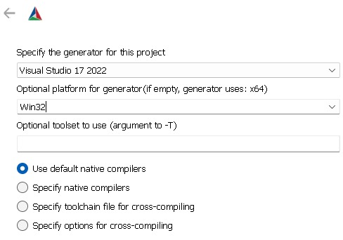

# CG

Este repositório contém o projeto da Unidade Curricular de **Computação Gráfica** (CG) no ano letivo 2024/2025, desenvolvido em C++ com OpenGL. O objetivo deste projeto é desenvolver um **motor 3D**.

## 📁 Estrutura do Projeto
```
CG/
├── src/
│   ├── engine/       # Código do motor de renderização
│   ├── generator/    # Código do gerador de primitivas
│   ├── models/       # Modelos gerados em formato .3d
│   ├── patchs/       # Patchs
│   ├── scenes/       # Arquivos XML das cenas
│   ├── shared/       # Código compartilhado entre os módulos
│   └── CMakeLists.txt
├── scripts/          # Scripts para automatizar testes
├── textures/         # Texturas
├── build/            # Diretório onde os binários são compilados
├── docs/             # Documentação do projeto
├── libs/             # Bibliotecas RapidXML
├── toolkits/         # Ficheiros adicionais
├── CMakeLists.txt    # Configuração principal do CMake
└── README.md         
```

## 🛠 Requisitos
Para compilar e executar o projeto, certifique-se de ter instalado:
- **CMake** (3.10+)
- **Compilador C++** 
- **OpenGL** e **GLUT**

## 🚀 Compilação
Após configurações iniciais do cmake no seu dispositivo e criando a pasta _build_, pode compilar o projeto executando:

- Linux
```sh
cd build
make
```

- Windows
    1. Aceda ao terminal do `cmake`
    2. Selecione a pasta principal e a respetiva pasta `build`
    3. Configure o projeto com as seguintes definições
    
    <div align="center" style="padding: 20px;">
        
    </div>

    4. Selecione a pasta `toolkits` na raiz do projeto
    5. Configure e gere o projeto.

    
Isso irá gerar os executáveis dentro da pasta build/.

## 🖌 Generator
Gera arquivos de modelo (`.3d`) contendo os vértices das primitivas gráficas.

Para gerar um modelo de primitiva, utilize o **generator**. 
Exemplo para gerar um plano:

```sh
cd build
./generator plane 2 3 plane_2_3.3d #Linux

.\Release\generator.exe plane 2 3 plane_2_3.3d
```

Também é possível gerar figuras a partir de _patches_ já criados: 

```sh
cd build
./generator patch teapot.patch 10 teapot1.3d # Linux

.\Release\generator.exe patch teapot.patch 10 teapot1.3d # Windows
```
## 🎮 Engine
Carrega arquivos XML contendo a configuração da cena e renderiza os modelos gerados.

Para visualizar uma cena, execute o engine. Por exemplo:

```sh
cd build
./engine ../src/scenes/tests/ours_tests/test_1_plane1.xml # Linux

.\Release\engine.exe ..\src\scenes\tests\ours_tests\test_1_plane1.xml # Windows
```

Isso irá carregar e renderizar a cena descrita no XML.

## 🪐 Exemplo de Cena - Sistema Solar
Para testar o funcionamento do sistema, disponibilizamos uma cena representando o **Sistema Solar**, onde:
- O **Sol** está fixo no centro.
- Os **planetas orbitam o Sol** com diferentes translações e rotações.
- Os **satélites naturais (luas) orbitam os planetas** como subgrupos.

Embora a cena esteja disponível, pode gerar os modelos necessários junto com um novo ficheiro _XML_ da cena (no interior da pasta `build`): 

```bash
./generator solar # Linux

.\Release\generator.exe solar # Windows
```

Caso já tenha a cena, sem os modelos, pode gerar os modelos, um a um: 

```bash
./generator torus 1.6 0.2 2 15 torus.3d
./generator cone 1 1 20 5 cone.3d
./generator sphere 1 20 20 sphere.3d
./generator box 1 1 box.3d
./generator patch comet.patch 10 comet.3d

.\Release\generator.exe ...
```

Para visualizar a cena, execute no terminal, no interior da pasta `build`:
```bash
./engine ../src/scenes/ours_tests/solar_system.xml

.\Release\engine.exe ...
```

Também disponibilizamos de um _script_ para executar as duas funcionalidades.

## 📖 Scripts

O projeto conta com scripts de automação, facilitando a compilação, limpeza e execução de testes.
Estes scripts são funcionais para Linux e estão localizados na pasta scripts/.

Antes de executar qualquer script, é necessário garantir que possuem permissão de execução.  
Caso contrário, utilize o seguinte comando para conceder permissão:

```
chmod -R +x scripts/
```

- **Compilar o projeto automaticamente**:
    ```
    ./scripts/compile/build.sh
    ```

- **Remover arquivos compilados**:
    ```
    ./scripts/compile/clean.sh
    ```

- **Limpar e recompilar**:
    ```
    ./scripts/compile/rebuild.sh
    ```

- **Testes automáticos - Exemplo**:
    ```
    ./scripts/phase1/s_plane1_p1.sh
    ```

## ✍️ Desenvolvido por: 

- [Edgar Ferreira](https://www.github.com/Edegare)
- [Fernando Pires](https://github.com/ferjpires)
- [Sara Silva](https://github.com/sarasilv-a)
- [Zita Duarte](https://github.com/zitamduarte)


